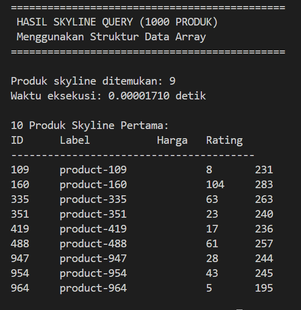
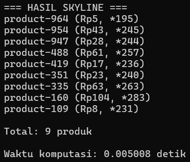
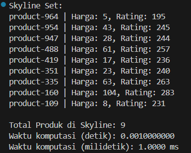
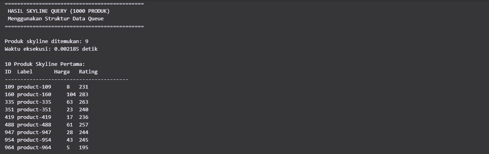
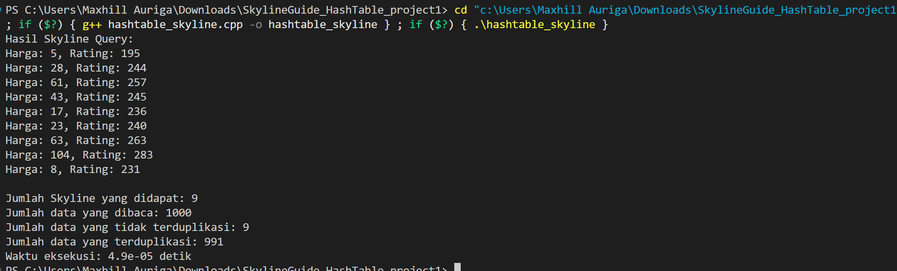
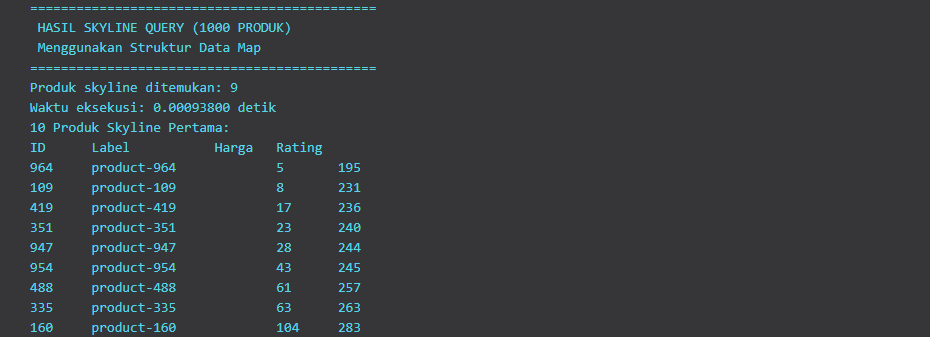

# Project 1 - Kelompok 7 | Struktur Data

## Member

| No  | Nama                        | NRP        |
| --- | --------------------------- | ---------- |
| 1   | Kanafira Vanesha Putri      | 5027241010 |
| 2   | Kaisar Hanif Pratama        | 5027241029 |
| 3   | Daniswara Fausta Novanto    | 5027241050 |
| 4   | Hafiz Ramadhan              | 5027241096 |
| 5   | M. Alfaeran Auriga Ruswandi | 5027241115 |

## Laporan hasil uji query

### 1. Manakah struktur data yang paling efisien dalam memproses skyline query? Mengapa?
Struktur data yang paling efisien dalam memproses skyline query adalah Array.

Array memungkinkan akses langsung (O(1)) ke elemen, sehingga sangat efisien untuk melakukan perbandingan dominasi antar data. Selain itu, array memiliki iterasi cepat karena elemen tersimpan berurutan di memori, dan dapat dioptimasi dengan sorting untuk mengurangi jumlah perbandingan.

Dibandingkan struktur lain, array memiliki performansi terbaik secara waktu dan memori dalam kasus skyline query yang melibatkan banyak data dan perbandingan.

### 2. Hasil performa 6 struktur data

| No  | Nama                        |    Waktu    |
| --- | --------------------------- | ----------- |
| 1   | Array                       |             |
| 2   | Linked List                 |   0.005008  |
| 3   | Stack                       |   0.001     |
| 4   | Queue                       |   0.003289  |
| 5   | Hash Table                  |   0.000049  |
| 6   | Map                         |   0.000068  |

Catatan: Hasil waktu dapat bervariasi tergantung spesifikasi perangkat dan kondisi runtime.

### 3. Analisis hasil performa 6 struktur data
Struktur data yang memiliki akses langsung seperti Array dan Map bekerja lebih efisien dalam melakukan perbandingan dominasi.

Struktur seperti Linked List lebih lambat karena traversal elemen O(n).

Struktur Stack dan Queue tidak terlalu efisien karena tidak mendukung pencarian fleksibel.

Hash Table cepat dalam lookup, namun tidak cocok untuk urutan atau dominasi.

### 4. Screenshot input program

### 5. Screenshot output program

#### Array

*Dibuat oleh : Kaisar Hanif Pratama 5027241029*

   .

#### Linked List

*Dibuat oleh : Daniswara Fausta Novanto 5027241050*

   

#### Stack

*Dibuat oleh : Hafiz Ramadhan 5027241096*

   

#### Queue

*Dibuat oleh : Kanafira Vanesha Putri 5027241010*

   

#### Hash Table

*Dibuat oleh : M. Alfaeran Auriga Ruswandi 5027241115*

   

#### Map

*Dibuat oleh : Kanafira Vanesha Putri 5027241010*

   
   
