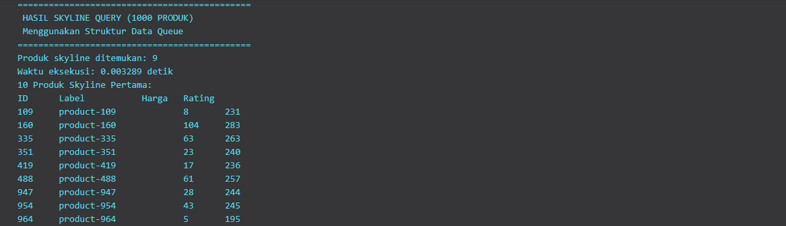

# Project 1 - Kelompok 7 | Struktur Data

## Member

| No  | Nama                        | NRP        |
| --- | --------------------------- | ---------- |
| 1   | Kanafira Vanesha Putri      | 5027241010 |
| 2   | Kaisar Hanif Pratama        | 5027241029 |
| 3   | Daniswara Fausta Novanto    | 5027241050 |
| 4   | Hafiz Ramadhan              | 5027241096 |
| 5   | M. Alfaeran Auriga Ruswandi | 5027241115 |

## Laporan hasil uji query

### 1. Manakah struktur data yang paling efisien dalam memproses skyline query? Mengapa?

### 2. Hasil performa 6 struktur data

| No  | Nama                        |    Waktu    |
| --- | --------------------------- | ----------- |
| 1   | Array                       |             |
| 2   | Linked List                 |   0.005008  |
| 3   | Stack                       |   0.001     |
| 4   | Queue                       |   0.003289  |
| 5   | Hash Table                  |   0.000049  |
| 6   | Map                         |   0.000938  |

### 3. Analisis hasil performa 6 struktur data

### 4. Screenshot input program

#### Hash Table

   

### 5. Screenshot output program

#### Linked List

   

#### Stack

   

#### Queue

   

#### Hash Table

   

#### Map

   
   
